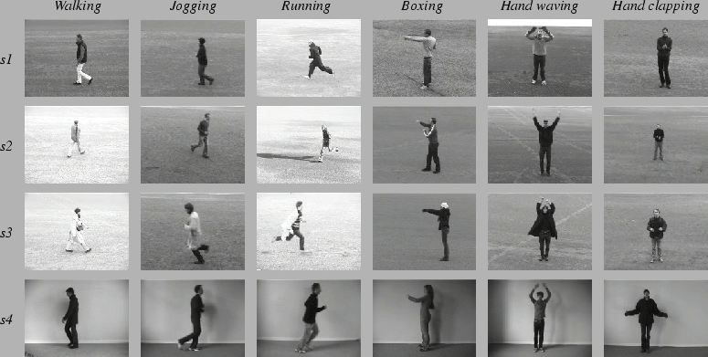
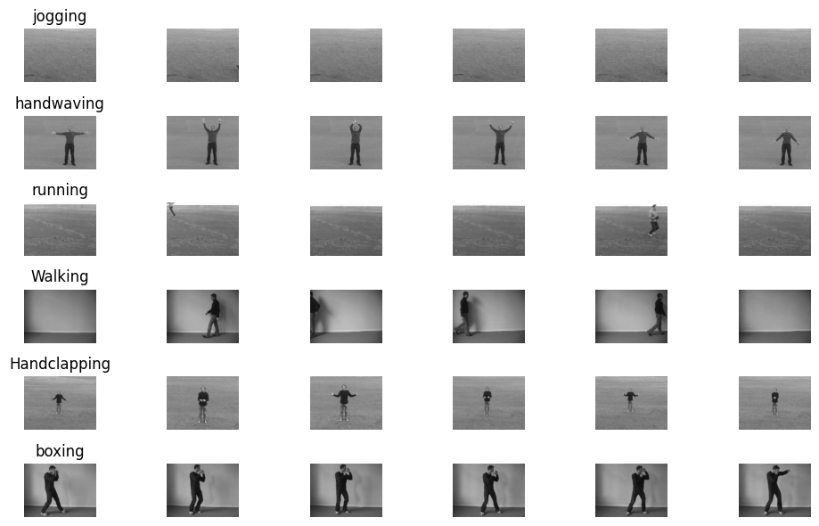
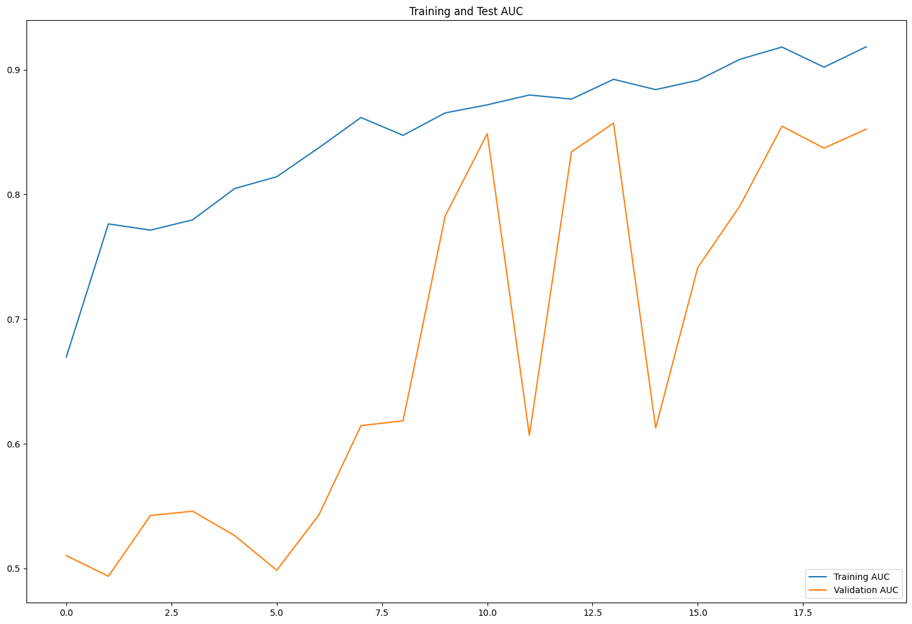
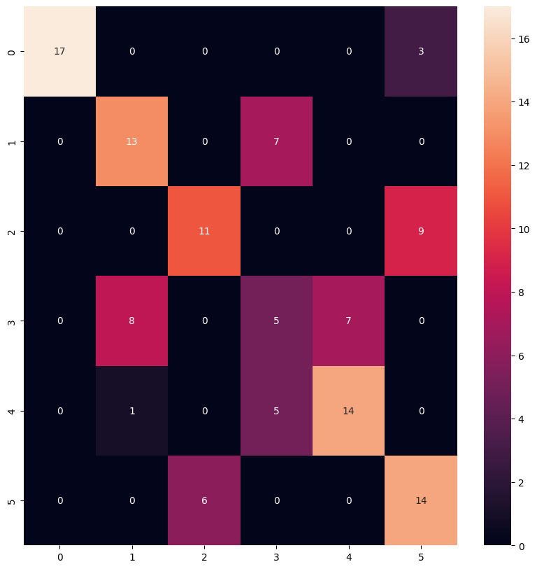

Video Action classification
==============================
Video-based Action Classification using LSTM

Dataset: This dataset consists of labeled videos of 6 human actions (walking, jogging, running, boxing, hand waving and hand clapping) performed several times by 25 subjects in four different scenarios: outdoors s1, outdoors with scale variation s2, outdoors with different clothes s3 and indoors s4 as illustrated below.

All sequences were taken over homogeneous backgrounds with a static camera with 25fps frame rate. The sequences were downsampled to the spatial resolution of 160x120 pixels and have a length of four seconds in average. In summary, there are 25x6x4=600 video files for each combination of 25 subjects, 6 actions and 4 scenarios. For this project we have randomly selected 20% of the data as test set.

Dataset source: https://www.csc.kth.se/cvap/actions/

Methodology:

When performing image classification, we input an image to our CNN; Obtain the predictions from the CNN; Choose the label with the largest corresponding probability

Since a video is just a series of image frames, in a video classification, we Loop over all frames in the video file;
 
For each frame, pass the frame through the CNN; Classify each frame individually and independently of each other; Choose the label with the largest corresponding probability; Label the frame and write the output frame to disk

Background: The CNN LSTM architecture involves using Convolutional Neural Network (CNN) layers for feature extraction on input data combined with LSTMs to support sequence prediction.

CNN LSTMs were developed for visual time series prediction problems and the application of generating textual descriptions from sequences of images (e.g. videos). Specifically, the problems of:

Activity Recognition: Generating a textual description of an activity demonstrated in a sequence of images Image Description: Generating a textual description of a single image. Video Description: Generating a textual description of a sequence of images. Applications: Applications such as surveillance, video retrieval and human-computer interaction require methods for recognizing human actions in various scenarios. In the area of robotics, the tasks of autonomous navigation or social interaction could also take advantage of the knowledge extracted from live video recordings. Typical scenarios include scenes with cluttered, moving backgrounds, nonstationary camera, scale variations, individual variations in appearance and cloth of people, changes in light and view point and so forth. All of these conditions introduce challenging problems that can be addressed using deep learning (computer vision) models.

Project Organization
------------

    ├── Makefile           <- Makefile with commands like `make data` or `make train`
    ├── README.md          <- The top-level README for developers using this project.
    ├── data
    │   ├── processed      <- The final, canonical data sets for modeling.
    │   └── raw            <- The original, immutable data dump.
    ├── models             <- Trained and serialized models, model predictions, or model summaries
    │
    ├── notebooks          <- Jupyter notebooks. 
    │
    ├── requirements.txt   <- The requirements file for reproducing the analysis environment, e.g.
    │                         generated with `pip freeze > requirements.txt`
    │
    ├── setup.py           <- makes project pip installable (pip install -e .) so src can be imported
    ├── src                <- Source code for use in this project.
    │   ├── __init__.py    <- Makes src a Python module
    │   │
    │   ├── data           <- Scripts to download or generate data
    │   │   └── make_dataset.py
    │   │
    │   ├── features       <- Scripts to turn raw data into features for modeling
    │   │   └── build_features.py
    │   │
    │   ├── models         <- Scripts to train models and then use trained models to make
    │   │   │                 predictions
    │   │   └── train_model.py
    │   │
    │   └── visualization  <- Scripts to create exploratory and results oriented visualizations
    │   │   └── visualize.py
    │   └── training.py    <- contains the main script  

--------

<small>Project based on the <a target="_blank" href="https://drivendata.github.io/cookiecutter-data-science/">cookiecutter data science project template</a>. #cookiecutterdatascience</small>

 
 Results: 
 Models: 
 1. Hyperparameter tuned model 
 Model.summary()

Model performance: Accuracy on Validation set: 85.23%
 

2. VGG16 pre-trained model
Model.summary()

Model performance: Accuracy on Validation set: 79.167%

Analysis: The model is getting confused between Running-Jogging-running and Handclapping-Handwaving.
